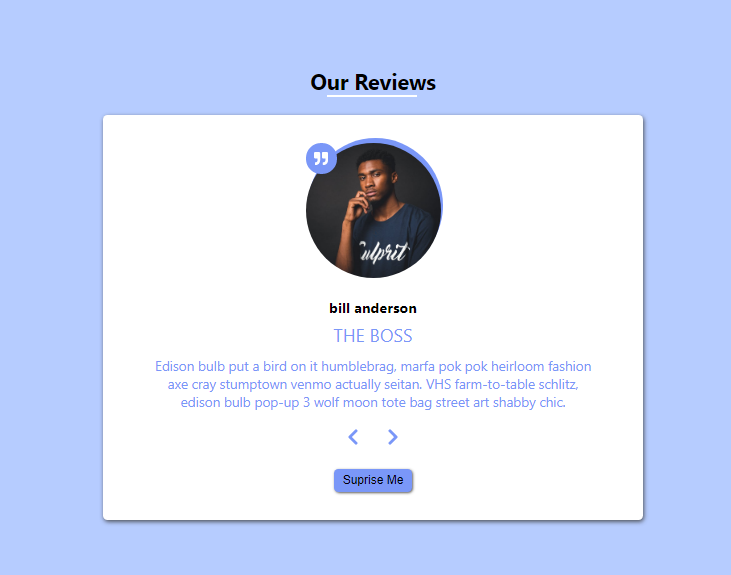

Completed The "Our Review Project", another minor project built usin the React Library and Vanilla Css.

This is simple project that makes use of the react hook to update and set the state of components. data is stored in an array as an object. the object consist of an image, the name, of the Job position and the testimonial of the reviewer. one can navigate through the various review with the left and right arrow buttons or one can decide to check at random each of the review with the surprise me button. the image below shows the complete picture of the project.

